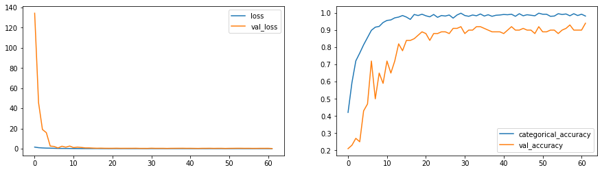

# Gesture Recognition
In this group project, you are going to build a 3D Conv model that will be able to predict the 5 gestures correctly. Please import the following libraries to get started. Once you have completed the code you can download the notebook for making a submission.


```python
import numpy as np
import os
from imageio import imread
from skimage.transform import resize
import datetime
import os
```

We set the random seed so that the results don't vary drastically.


```python
np.random.seed(30)
import random as rn
rn.seed(30)
from tensorflow import keras
import tensorflow as tf
tf.random.set_seed(30)
```

In this block, you read the folder names for training and validation. You also set the `batch_size` here. Note that you set the batch size in such a way that you are able to use the GPU in full capacity. You keep increasing the batch size until the machine throws an error.


```python
def plot(history):
    fig, axes = plt.subplots(nrows=1, ncols=2, figsize=(15,4))
    axes[0].plot(history.history['loss'])   
    axes[0].plot(history.history['val_loss'])
    axes[0].legend(['loss','val_loss'])

    axes[1].plot(history.history['categorical_accuracy'])   
    axes[1].plot(history.history['val_categorical_accuracy'])
    axes[1].legend(['categorical_accuracy','val_accuracy'])
```

**data path: /home/datasets/Project_data**


```python
train_doc = np.random.permutation(open('/home/datasets/Project_data/train.csv').readlines())
val_doc = np.random.permutation(open('/home/datasets/Project_data/val.csv').readlines())
# Our Hyperparameters
batch_size = 32 #experiment with the batch size
image_height=120
image_width=120
channels=3
num_classes=5
total_frames=30
frame_samples=16
num_epochs = 62
```

## Generator
This is one of the most important part of the code. The overall structure of the generator has been given. In the generator, you are going to preprocess the images as you have images of 2 different dimensions as well as create a batch of video frames. You have to experiment with `img_idx`, `y`,`z` and normalization such that you get high accuracy.


```python
def generator(source_path, folder_list, batch_size):
    print( 'Source path = ', source_path, '; batch size =', batch_size)
    img_idx = np.round(np.linspace(0,total_frames-1,frame_samples)).astype(int)#create a list of image numbers you want to use for a particular video
    while True:
        t = np.random.permutation(folder_list)
        num_batches = len(t)//batch_size# calculate the number of batches

        for batch in range(num_batches): # we iterate over the number of batches

            remaining_seq=0 #To track for remainning sequence

            batch_data = np.zeros((batch_size,len(img_idx),image_height,image_width,3)) # len(img_idx) is the number of images you use for each video, (image_height,image_width) is the final size of the input images and 3 is the number of channels RGB
            batch_labels = np.zeros((batch_size,5)) # batch_labels is the one hot representation of the output
            for folder in range(batch_size): # iterate over the batch_size
                imgs = os.listdir(source_path+'/'+ t[folder + (batch*batch_size)].split(';')[0]) # read all the images in the folder
                for idx,item in enumerate(img_idx): #  Iterate iver the frames/images of a folder to read them in
                    image = imread(source_path+'/'+ t[folder + (batch*batch_size)].strip().split(';')[0]+'/'+imgs[item]).astype(np.float32)
                    if image.shape[0] != image.shape[1]:
                        image=image[0:120,10:150]
                    else:
                        image=image[30:330,20:340]

                    image_resized=resize(image,(image_height,image_width,3))
                    
                    #crop the images and resize them. Note that the images are of 2 different shape 
                    #and the conv3D will throw error if the inputs in a batch have different shapes
                    
                    batch_data[folder,idx,:,:,0] = (image_resized[:,:,0])/255 #normalise and feed in the image
                    batch_data[folder,idx,:,:,1] = (image_resized[:,:,1])/255 #normalise and feed in the image
                    batch_data[folder,idx,:,:,2] = (image_resized[:,:,2])/255 #normalise and feed in the image

                    
                    
                batch_labels[folder, int(t[folder + (batch*batch_size)].strip().split(';')[2])] = 1
            yield batch_data, batch_labels #you yield the batch_data and the batch_labels, remember what does yield do

        
        # write the code for the remaining data points which are left after full batches
        remaining_seq=len(t)%batch_size #To track for remainning sequence
        
        if (remaining_seq != 0):
            seq_len = remaining_seq #To track for remainning sequence

            batch_data = np.zeros((seq_len,len(img_idx),image_height,image_width,3)) # len(img_idx) is the number of images you use for each video, (image_height,image_width) is the final size of the input images and 3 is the number of channels RGB
            batch_labels = np.zeros((seq_len,5)) # batch_labels is the one hot representation of the output
            for folder in range(seq_len): # iterate over the batch_size
                imgs = os.listdir(source_path+'/'+ t[folder + (batch*batch_size)].split(';')[0]) # read all the images in the folder
                for idx,item in enumerate(img_idx): #  Iterate iver the frames/images of a folder to read them in
                    image = imread(source_path+'/'+ t[folder + (batch*batch_size)].strip().split(';')[0]+'/'+imgs[item]).astype(np.float32)
                    if image.shape[0] != image.shape[1]:
                        image=image[0:120,10:150]
                    else:
                        image=image[30:340,20:340]
                    image_resized=resize(image,(image_height,image_width,3))
                    
                    #crop the images and resize them. Note that the images are of 2 different shape 
                    #and the conv3D will throw error if the inputs in a batch have different shapes
                    
                    batch_data[folder,idx,:,:,0] = (image_resized[:,:,0])/255 #normalise and feed in the image
                    batch_data[folder,idx,:,:,1] = (image_resized[:,:,1])/255 #normalise and feed in the image
                    batch_data[folder,idx,:,:,2] = (image_resized[:,:,2])/255 #normalise and feed in the image

                    
                    
                batch_labels[folder, int(t[folder + (batch*batch_size)].strip().split(';')[2])] = 1
            yield batch_data, batch_labels #you yield the batch_data and the batch_labels, remember what does yield do
```

Note here that a video is represented above in the generator as (number of images, height, width, number of channels). Take this into consideration while creating the model architecture.


```python
curr_dt_time = datetime.datetime.now()
train_path = '/home/datasets/Project_data/train'
val_path = '/home/datasets/Project_data/val'
num_train_sequences = len(train_doc)
print('# training sequences =', num_train_sequences)
num_val_sequences = len(val_doc)
print('# validation sequences =', num_val_sequences)
print ('# epochs =', num_epochs)
```

    # training sequences = 663
    # validation sequences = 100
    # epochs = 62
    

## Model
Here you make the model using different functionalities that Keras provides. Remember to use `Conv3D` and `MaxPooling3D` and not `Conv2D` and `Maxpooling2D` for a 3D convolution model. You would want to use `TimeDistributed` while building a Conv2D + RNN model. Also remember that the last layer is the softmax. Design the network in such a way that the model is able to give good accuracy on the least number of parameters so that it can fit in the memory of the webcam.


```python
from tensorflow.keras.models import Sequential
from tensorflow.keras.layers import Dense, GRU, Dropout, Flatten, BatchNormalization, Activation, Conv3D, MaxPooling3D
from tensorflow.keras.callbacks import ModelCheckpoint, ReduceLROnPlateau
from tensorflow.keras import optimizers

#write your model here
model = Sequential()
model.add(Conv3D(16, (3,3,3), padding='same',input_shape=(frame_samples,image_height,image_width,channels)))
model.add(BatchNormalization())
model.add(Activation('relu'))
model.add(MaxPooling3D(pool_size=(2, 2, 2)))
#model.add(Dropout(0.4))


model.add(Conv3D(32, (3,3,3), padding='same'))
model.add(BatchNormalization())
model.add(Activation('relu'))
model.add(MaxPooling3D(pool_size=(2, 2, 2)))
#model.add(Dropout(0.4))


model.add(Conv3D(64, (3,3,3), padding='same'))
model.add(BatchNormalization())
model.add(Activation('relu'))
model.add(MaxPooling3D(pool_size=(2, 2, 2)))
model.add(Dropout(0.4))


#model.add(Conv3D(128, (3,3,3), padding='same'))
#model.add(Activation('relu'))
#model.add(BatchNormalization())
#model.add(MaxPooling3D(pool_size=(2, 2, 2)))

model.add(Flatten())
model.add(Dense(256,activation='relu'))
model.add(BatchNormalization())
model.add(Dropout(0.5))

#model.add(Dense(128,activation='relu'))
#model.add(BatchNormalization())
#model.add(Dropout(0.5))

model.add(Dense(num_classes,activation='softmax'))

```

Now that you have written the model, the next step is to `compile` the model. When you print the `summary` of the model, you'll see the total number of parameters you have to train.


```python
optimiser = optimizers.Adam(lr=0.009)#write your optimizer
model.compile(optimizer=optimiser, loss='categorical_crossentropy', metrics=['categorical_accuracy'])
print (model.summary())
```

    Model: "sequential"
    _________________________________________________________________
    Layer (type)                 Output Shape              Param #   
    =================================================================
    conv3d (Conv3D)              (None, 16, 120, 120, 16)  1312      
    _________________________________________________________________
    batch_normalization (BatchNo (None, 16, 120, 120, 16)  64        
    _________________________________________________________________
    activation (Activation)      (None, 16, 120, 120, 16)  0         
    _________________________________________________________________
    max_pooling3d (MaxPooling3D) (None, 8, 60, 60, 16)     0         
    _________________________________________________________________
    conv3d_1 (Conv3D)            (None, 8, 60, 60, 32)     13856     
    _________________________________________________________________
    batch_normalization_1 (Batch (None, 8, 60, 60, 32)     128       
    _________________________________________________________________
    activation_1 (Activation)    (None, 8, 60, 60, 32)     0         
    _________________________________________________________________
    max_pooling3d_1 (MaxPooling3 (None, 4, 30, 30, 32)     0         
    _________________________________________________________________
    conv3d_2 (Conv3D)            (None, 4, 30, 30, 64)     55360     
    _________________________________________________________________
    batch_normalization_2 (Batch (None, 4, 30, 30, 64)     256       
    _________________________________________________________________
    activation_2 (Activation)    (None, 4, 30, 30, 64)     0         
    _________________________________________________________________
    max_pooling3d_2 (MaxPooling3 (None, 2, 15, 15, 64)     0         
    _________________________________________________________________
    dropout (Dropout)            (None, 2, 15, 15, 64)     0         
    _________________________________________________________________
    flatten (Flatten)            (None, 28800)             0         
    _________________________________________________________________
    dense (Dense)                (None, 256)               7373056   
    _________________________________________________________________
    batch_normalization_3 (Batch (None, 256)               1024      
    _________________________________________________________________
    dropout_1 (Dropout)          (None, 256)               0         
    _________________________________________________________________
    dense_1 (Dense)              (None, 5)                 1285      
    =================================================================
    Total params: 7,446,341
    Trainable params: 7,445,605
    Non-trainable params: 736
    _________________________________________________________________
    None
    

Let us create the `train_generator` and the `val_generator` which will be used in `.fit_generator`.


```python
train_generator = generator(train_path, train_doc, batch_size)
val_generator = generator(val_path, val_doc, batch_size)
```


```python
model_name = 'model' + '_' + str(curr_dt_time).replace(' ','').replace(':','_') + '/'
    
if not os.path.exists(model_name):
    os.mkdir(model_name)
        
filepath = model_name + 'model-{epoch:05d}-{loss:.5f}-{categorical_accuracy:.5f}-{val_loss:.5f}-{val_categorical_accuracy:.5f}.h5'

checkpoint = ModelCheckpoint(filepath, monitor='val_loss', verbose=1, save_best_only=False, save_weights_only=False, mode='auto',period = 1)

LR = ReduceLROnPlateau(monitor='val_loss', factor=0.01, patience=5, cooldown=4, verbose=1,mode='auto',epsilon=0.0001)# write the REducelronplateau code here
callbacks_list = [checkpoint, LR]
```

    WARNING:tensorflow:`period` argument is deprecated. Please use `save_freq` to specify the frequency in number of batches seen.
    WARNING:tensorflow:`epsilon` argument is deprecated and will be removed, use `min_delta` instead.
    

The `steps_per_epoch` and `validation_steps` are used by `fit` method to decide the number of next() calls it need to make.


```python
if (num_train_sequences%batch_size) == 0:
    steps_per_epoch = int(num_train_sequences/batch_size)
else:
    steps_per_epoch = (num_train_sequences//batch_size) + 1

if (num_val_sequences%batch_size) == 0:
    validation_steps = int(num_val_sequences/batch_size)
else:
    validation_steps = (num_val_sequences//batch_size) + 1
```

Let us now fit the model. This will start training the model and with the help of the checkpoints, you'll be able to save the model at the end of each epoch.


```python
history = model.fit(train_generator, steps_per_epoch=steps_per_epoch, epochs=num_epochs, verbose=1, 
                    callbacks=callbacks_list, validation_data=val_generator, 
                    validation_steps=validation_steps, class_weight=None, workers=1, initial_epoch=0)
```

    Source path =  /home/datasets/Project_data/train ; batch size = 32
    Epoch 1/62
    21/21 [==============================] - ETA: 0s - loss: 1.5595 - categorical_accuracy: 0.4208Source path =  /home/datasets/Project_data/val ; batch size = 32
    
    Epoch 00001: saving model to model_2021-06-2711_07_38.791020/model-00001-1.55945-0.42081-134.33029-0.21000.h5
    21/21 [==============================] - 70s 3s/step - loss: 1.5595 - categorical_accuracy: 0.4208 - val_loss: 134.3303 - val_categorical_accuracy: 0.2100
    Epoch 2/62
    21/21 [==============================] - ETA: 0s - loss: 0.9805 - categorical_accuracy: 0.5943
    Epoch 00002: saving model to model_2021-06-2711_07_38.791020/model-00002-0.98051-0.59427-45.58620-0.23000.h5
    21/21 [==============================] - 73s 3s/step - loss: 0.9805 - categorical_accuracy: 0.5943 - val_loss: 45.5862 - val_categorical_accuracy: 0.2300
    Epoch 3/62
    21/21 [==============================] - ETA: 0s - loss: 0.7353 - categorical_accuracy: 0.7210
    Epoch 00003: saving model to model_2021-06-2711_07_38.791020/model-00003-0.73531-0.72097-19.00770-0.27000.h5
    21/21 [==============================] - 72s 3s/step - loss: 0.7353 - categorical_accuracy: 0.7210 - val_loss: 19.0077 - val_categorical_accuracy: 0.2700
    Epoch 4/62
    21/21 [==============================] - ETA: 0s - loss: 0.5677 - categorical_accuracy: 0.7662
    Epoch 00004: saving model to model_2021-06-2711_07_38.791020/model-00004-0.56769-0.76621-15.87168-0.25000.h5
    21/21 [==============================] - 70s 3s/step - loss: 0.5677 - categorical_accuracy: 0.7662 - val_loss: 15.8717 - val_categorical_accuracy: 0.2500
    Epoch 5/62
    21/21 [==============================] - ETA: 0s - loss: 0.5216 - categorical_accuracy: 0.8145
    Epoch 00005: saving model to model_2021-06-2711_07_38.791020/model-00005-0.52156-0.81448-2.56329-0.43000.h5
    21/21 [==============================] - 72s 3s/step - loss: 0.5216 - categorical_accuracy: 0.8145 - val_loss: 2.5633 - val_categorical_accuracy: 0.4300
    Epoch 6/62
    21/21 [==============================] - ETA: 0s - loss: 0.3695 - categorical_accuracy: 0.8567
    Epoch 00006: saving model to model_2021-06-2711_07_38.791020/model-00006-0.36950-0.85671-2.18063-0.47000.h5
    21/21 [==============================] - 74s 4s/step - loss: 0.3695 - categorical_accuracy: 0.8567 - val_loss: 2.1806 - val_categorical_accuracy: 0.4700
    Epoch 7/62
    21/21 [==============================] - ETA: 0s - loss: 0.2754 - categorical_accuracy: 0.8989
    Epoch 00007: saving model to model_2021-06-2711_07_38.791020/model-00007-0.27544-0.89894-0.70012-0.72000.h5
    21/21 [==============================] - 74s 4s/step - loss: 0.2754 - categorical_accuracy: 0.8989 - val_loss: 0.7001 - val_categorical_accuracy: 0.7200
    Epoch 8/62
    21/21 [==============================] - ETA: 0s - loss: 0.2390 - categorical_accuracy: 0.9170
    Epoch 00008: saving model to model_2021-06-2711_07_38.791020/model-00008-0.23901-0.91704-2.42922-0.50000.h5
    21/21 [==============================] - 69s 3s/step - loss: 0.2390 - categorical_accuracy: 0.9170 - val_loss: 2.4292 - val_categorical_accuracy: 0.5000
    Epoch 9/62
    21/21 [==============================] - ETA: 0s - loss: 0.2223 - categorical_accuracy: 0.9216
    Epoch 00009: saving model to model_2021-06-2711_07_38.791020/model-00009-0.22235-0.92157-1.47980-0.65000.h5
    21/21 [==============================] - 71s 3s/step - loss: 0.2223 - categorical_accuracy: 0.9216 - val_loss: 1.4798 - val_categorical_accuracy: 0.6500
    Epoch 10/62
    21/21 [==============================] - ETA: 0s - loss: 0.1823 - categorical_accuracy: 0.9442
    Epoch 00010: saving model to model_2021-06-2711_07_38.791020/model-00010-0.18233-0.94419-2.57295-0.59000.h5
    21/21 [==============================] - 71s 3s/step - loss: 0.1823 - categorical_accuracy: 0.9442 - val_loss: 2.5730 - val_categorical_accuracy: 0.5900
    Epoch 11/62
    21/21 [==============================] - ETA: 0s - loss: 0.1434 - categorical_accuracy: 0.9563
    Epoch 00011: saving model to model_2021-06-2711_07_38.791020/model-00011-0.14339-0.95626-1.07276-0.72000.h5
    21/21 [==============================] - 70s 3s/step - loss: 0.1434 - categorical_accuracy: 0.9563 - val_loss: 1.0728 - val_categorical_accuracy: 0.7200
    Epoch 12/62
    21/21 [==============================] - ETA: 0s - loss: 0.1174 - categorical_accuracy: 0.9593
    Epoch 00012: saving model to model_2021-06-2711_07_38.791020/model-00012-0.11743-0.95928-1.54299-0.65000.h5
    
    Epoch 00012: ReduceLROnPlateau reducing learning rate to 8.999999612569808e-05.
    21/21 [==============================] - 68s 3s/step - loss: 0.1174 - categorical_accuracy: 0.9593 - val_loss: 1.5430 - val_categorical_accuracy: 0.6500
    Epoch 13/62
    21/21 [==============================] - ETA: 0s - loss: 0.0853 - categorical_accuracy: 0.9713
    Epoch 00013: saving model to model_2021-06-2711_07_38.791020/model-00013-0.08530-0.97134-1.22011-0.72000.h5
    21/21 [==============================] - 69s 3s/step - loss: 0.0853 - categorical_accuracy: 0.9713 - val_loss: 1.2201 - val_categorical_accuracy: 0.7200
    Epoch 14/62
    21/21 [==============================] - ETA: 0s - loss: 0.0763 - categorical_accuracy: 0.9759
    Epoch 00014: saving model to model_2021-06-2711_07_38.791020/model-00014-0.07628-0.97587-0.76473-0.82000.h5
    21/21 [==============================] - 71s 3s/step - loss: 0.0763 - categorical_accuracy: 0.9759 - val_loss: 0.7647 - val_categorical_accuracy: 0.8200
    Epoch 15/62
    21/21 [==============================] - ETA: 0s - loss: 0.0697 - categorical_accuracy: 0.9849
    Epoch 00015: saving model to model_2021-06-2711_07_38.791020/model-00015-0.06975-0.98492-0.76628-0.78000.h5
    21/21 [==============================] - 72s 3s/step - loss: 0.0697 - categorical_accuracy: 0.9849 - val_loss: 0.7663 - val_categorical_accuracy: 0.7800
    Epoch 16/62
    21/21 [==============================] - ETA: 0s - loss: 0.0726 - categorical_accuracy: 0.9759
    Epoch 00016: saving model to model_2021-06-2711_07_38.791020/model-00016-0.07258-0.97587-0.55069-0.84000.h5
    21/21 [==============================] - 67s 3s/step - loss: 0.0726 - categorical_accuracy: 0.9759 - val_loss: 0.5507 - val_categorical_accuracy: 0.8400
    Epoch 17/62
    21/21 [==============================] - ETA: 0s - loss: 0.1027 - categorical_accuracy: 0.9623
    Epoch 00017: saving model to model_2021-06-2711_07_38.791020/model-00017-0.10273-0.96229-0.41232-0.84000.h5
    21/21 [==============================] - 69s 3s/step - loss: 0.1027 - categorical_accuracy: 0.9623 - val_loss: 0.4123 - val_categorical_accuracy: 0.8400
    Epoch 18/62
    21/21 [==============================] - ETA: 0s - loss: 0.0499 - categorical_accuracy: 0.9910
    Epoch 00018: saving model to model_2021-06-2711_07_38.791020/model-00018-0.04987-0.99095-0.49211-0.85000.h5
    21/21 [==============================] - 70s 3s/step - loss: 0.0499 - categorical_accuracy: 0.9910 - val_loss: 0.4921 - val_categorical_accuracy: 0.8500
    Epoch 19/62
    21/21 [==============================] - ETA: 0s - loss: 0.0590 - categorical_accuracy: 0.9849
    Epoch 00019: saving model to model_2021-06-2711_07_38.791020/model-00019-0.05899-0.98492-0.38509-0.87000.h5
    21/21 [==============================] - 71s 3s/step - loss: 0.0590 - categorical_accuracy: 0.9849 - val_loss: 0.3851 - val_categorical_accuracy: 0.8700
    Epoch 20/62
    21/21 [==============================] - ETA: 0s - loss: 0.0410 - categorical_accuracy: 0.9925
    Epoch 00020: saving model to model_2021-06-2711_07_38.791020/model-00020-0.04097-0.99246-0.34931-0.89000.h5
    21/21 [==============================] - 67s 3s/step - loss: 0.0410 - categorical_accuracy: 0.9925 - val_loss: 0.3493 - val_categorical_accuracy: 0.8900
    Epoch 21/62
    21/21 [==============================] - ETA: 0s - loss: 0.0573 - categorical_accuracy: 0.9834
    Epoch 00021: saving model to model_2021-06-2711_07_38.791020/model-00021-0.05735-0.98341-0.36788-0.88000.h5
    21/21 [==============================] - 71s 3s/step - loss: 0.0573 - categorical_accuracy: 0.9834 - val_loss: 0.3679 - val_categorical_accuracy: 0.8800
    Epoch 22/62
    21/21 [==============================] - ETA: 0s - loss: 0.0687 - categorical_accuracy: 0.9774
    Epoch 00022: saving model to model_2021-06-2711_07_38.791020/model-00022-0.06868-0.97738-0.43010-0.84000.h5
    21/21 [==============================] - 70s 3s/step - loss: 0.0687 - categorical_accuracy: 0.9774 - val_loss: 0.4301 - val_categorical_accuracy: 0.8400
    Epoch 23/62
    21/21 [==============================] - ETA: 0s - loss: 0.0495 - categorical_accuracy: 0.9910
    Epoch 00023: saving model to model_2021-06-2711_07_38.791020/model-00023-0.04949-0.99095-0.34236-0.88000.h5
    21/21 [==============================] - 70s 3s/step - loss: 0.0495 - categorical_accuracy: 0.9910 - val_loss: 0.3424 - val_categorical_accuracy: 0.8800
    Epoch 24/62
    21/21 [==============================] - ETA: 0s - loss: 0.0709 - categorical_accuracy: 0.9744
    Epoch 00024: saving model to model_2021-06-2711_07_38.791020/model-00024-0.07095-0.97436-0.35519-0.88000.h5
    21/21 [==============================] - 67s 3s/step - loss: 0.0709 - categorical_accuracy: 0.9744 - val_loss: 0.3552 - val_categorical_accuracy: 0.8800
    Epoch 25/62
    21/21 [==============================] - ETA: 0s - loss: 0.0525 - categorical_accuracy: 0.9849
    Epoch 00025: saving model to model_2021-06-2711_07_38.791020/model-00025-0.05250-0.98492-0.34796-0.89000.h5
    21/21 [==============================] - 69s 3s/step - loss: 0.0525 - categorical_accuracy: 0.9849 - val_loss: 0.3480 - val_categorical_accuracy: 0.8900
    Epoch 26/62
    21/21 [==============================] - ETA: 0s - loss: 0.0545 - categorical_accuracy: 0.9819
    Epoch 00026: saving model to model_2021-06-2711_07_38.791020/model-00026-0.05448-0.98190-0.35833-0.89000.h5
    21/21 [==============================] - 70s 3s/step - loss: 0.0545 - categorical_accuracy: 0.9819 - val_loss: 0.3583 - val_categorical_accuracy: 0.8900
    Epoch 27/62
    21/21 [==============================] - ETA: 0s - loss: 0.0504 - categorical_accuracy: 0.9879
    Epoch 00027: saving model to model_2021-06-2711_07_38.791020/model-00027-0.05037-0.98793-0.39564-0.88000.h5
    21/21 [==============================] - 70s 3s/step - loss: 0.0504 - categorical_accuracy: 0.9879 - val_loss: 0.3956 - val_categorical_accuracy: 0.8800
    Epoch 28/62
    21/21 [==============================] - ETA: 0s - loss: 0.0692 - categorical_accuracy: 0.9698
    Epoch 00028: saving model to model_2021-06-2711_07_38.791020/model-00028-0.06919-0.96983-0.28273-0.91000.h5
    21/21 [==============================] - 67s 3s/step - loss: 0.0692 - categorical_accuracy: 0.9698 - val_loss: 0.2827 - val_categorical_accuracy: 0.9100
    Epoch 29/62
    21/21 [==============================] - ETA: 0s - loss: 0.0509 - categorical_accuracy: 0.9879
    Epoch 00029: saving model to model_2021-06-2711_07_38.791020/model-00029-0.05087-0.98793-0.28350-0.91000.h5
    21/21 [==============================] - 70s 3s/step - loss: 0.0509 - categorical_accuracy: 0.9879 - val_loss: 0.2835 - val_categorical_accuracy: 0.9100
    Epoch 30/62
    21/21 [==============================] - ETA: 0s - loss: 0.0372 - categorical_accuracy: 0.9985
    Epoch 00030: saving model to model_2021-06-2711_07_38.791020/model-00030-0.03724-0.99849-0.25441-0.92000.h5
    21/21 [==============================] - 69s 3s/step - loss: 0.0372 - categorical_accuracy: 0.9985 - val_loss: 0.2544 - val_categorical_accuracy: 0.9200
    Epoch 31/62
    21/21 [==============================] - ETA: 0s - loss: 0.0554 - categorical_accuracy: 0.9849
    Epoch 00031: saving model to model_2021-06-2711_07_38.791020/model-00031-0.05535-0.98492-0.44432-0.88000.h5
    21/21 [==============================] - 71s 3s/step - loss: 0.0554 - categorical_accuracy: 0.9849 - val_loss: 0.4443 - val_categorical_accuracy: 0.8800
    Epoch 32/62
    21/21 [==============================] - ETA: 0s - loss: 0.0475 - categorical_accuracy: 0.9804
    Epoch 00032: saving model to model_2021-06-2711_07_38.791020/model-00032-0.04749-0.98039-0.32200-0.90000.h5
    21/21 [==============================] - 67s 3s/step - loss: 0.0475 - categorical_accuracy: 0.9804 - val_loss: 0.3220 - val_categorical_accuracy: 0.9000
    Epoch 33/62
    21/21 [==============================] - ETA: 0s - loss: 0.0504 - categorical_accuracy: 0.9879
    Epoch 00033: saving model to model_2021-06-2711_07_38.791020/model-00033-0.05043-0.98793-0.32458-0.90000.h5
    21/21 [==============================] - 69s 3s/step - loss: 0.0504 - categorical_accuracy: 0.9879 - val_loss: 0.3246 - val_categorical_accuracy: 0.9000
    Epoch 34/62
    21/21 [==============================] - ETA: 0s - loss: 0.0554 - categorical_accuracy: 0.9834
    Epoch 00034: saving model to model_2021-06-2711_07_38.791020/model-00034-0.05539-0.98341-0.33143-0.92000.h5
    21/21 [==============================] - 71s 3s/step - loss: 0.0554 - categorical_accuracy: 0.9834 - val_loss: 0.3314 - val_categorical_accuracy: 0.9200
    Epoch 35/62
    21/21 [==============================] - ETA: 0s - loss: 0.0382 - categorical_accuracy: 0.9940
    Epoch 00035: saving model to model_2021-06-2711_07_38.791020/model-00035-0.03825-0.99397-0.22969-0.92000.h5
    21/21 [==============================] - 70s 3s/step - loss: 0.0382 - categorical_accuracy: 0.9940 - val_loss: 0.2297 - val_categorical_accuracy: 0.9200
    Epoch 36/62
    21/21 [==============================] - ETA: 0s - loss: 0.0575 - categorical_accuracy: 0.9819
    Epoch 00036: saving model to model_2021-06-2711_07_38.791020/model-00036-0.05748-0.98190-0.33281-0.91000.h5
    21/21 [==============================] - 68s 3s/step - loss: 0.0575 - categorical_accuracy: 0.9819 - val_loss: 0.3328 - val_categorical_accuracy: 0.9100
    Epoch 37/62
    21/21 [==============================] - ETA: 0s - loss: 0.0530 - categorical_accuracy: 0.9894
    Epoch 00037: saving model to model_2021-06-2711_07_38.791020/model-00037-0.05304-0.98944-0.35337-0.90000.h5
    21/21 [==============================] - 70s 3s/step - loss: 0.0530 - categorical_accuracy: 0.9894 - val_loss: 0.3534 - val_categorical_accuracy: 0.9000
    Epoch 38/62
    21/21 [==============================] - ETA: 0s - loss: 0.0530 - categorical_accuracy: 0.9804
    Epoch 00038: saving model to model_2021-06-2711_07_38.791020/model-00038-0.05304-0.98039-0.37319-0.89000.h5
    21/21 [==============================] - 71s 3s/step - loss: 0.0530 - categorical_accuracy: 0.9804 - val_loss: 0.3732 - val_categorical_accuracy: 0.8900
    Epoch 39/62
    21/21 [==============================] - ETA: 0s - loss: 0.0403 - categorical_accuracy: 0.9864
    Epoch 00039: saving model to model_2021-06-2711_07_38.791020/model-00039-0.04028-0.98643-0.40226-0.89000.h5
    21/21 [==============================] - 72s 3s/step - loss: 0.0403 - categorical_accuracy: 0.9864 - val_loss: 0.4023 - val_categorical_accuracy: 0.8900
    Epoch 40/62
    21/21 [==============================] - ETA: 0s - loss: 0.0488 - categorical_accuracy: 0.9879
    Epoch 00040: saving model to model_2021-06-2711_07_38.791020/model-00040-0.04883-0.98793-0.32490-0.89000.h5
    
    Epoch 00040: ReduceLROnPlateau reducing learning rate to 8.999999408842996e-07.
    21/21 [==============================] - 69s 3s/step - loss: 0.0488 - categorical_accuracy: 0.9879 - val_loss: 0.3249 - val_categorical_accuracy: 0.8900
    Epoch 41/62
    21/21 [==============================] - ETA: 0s - loss: 0.0406 - categorical_accuracy: 0.9910
    Epoch 00041: saving model to model_2021-06-2711_07_38.791020/model-00041-0.04058-0.99095-0.34474-0.88000.h5
    21/21 [==============================] - 71s 3s/step - loss: 0.0406 - categorical_accuracy: 0.9910 - val_loss: 0.3447 - val_categorical_accuracy: 0.8800
    Epoch 42/62
    21/21 [==============================] - ETA: 0s - loss: 0.0299 - categorical_accuracy: 0.9894
    Epoch 00042: saving model to model_2021-06-2711_07_38.791020/model-00042-0.02989-0.98944-0.28578-0.90000.h5
    21/21 [==============================] - 70s 3s/step - loss: 0.0299 - categorical_accuracy: 0.9894 - val_loss: 0.2858 - val_categorical_accuracy: 0.9000
    Epoch 43/62
    21/21 [==============================] - ETA: 0s - loss: 0.0315 - categorical_accuracy: 0.9925
    Epoch 00043: saving model to model_2021-06-2711_07_38.791020/model-00043-0.03147-0.99246-0.22249-0.92000.h5
    21/21 [==============================] - 71s 3s/step - loss: 0.0315 - categorical_accuracy: 0.9925 - val_loss: 0.2225 - val_categorical_accuracy: 0.9200
    Epoch 44/62
    21/21 [==============================] - ETA: 0s - loss: 0.0532 - categorical_accuracy: 0.9804
    Epoch 00044: saving model to model_2021-06-2711_07_38.791020/model-00044-0.05321-0.98039-0.33795-0.90000.h5
    21/21 [==============================] - 69s 3s/step - loss: 0.0532 - categorical_accuracy: 0.9804 - val_loss: 0.3379 - val_categorical_accuracy: 0.9000
    Epoch 45/62
    21/21 [==============================] - ETA: 0s - loss: 0.0300 - categorical_accuracy: 0.9955
    Epoch 00045: saving model to model_2021-06-2711_07_38.791020/model-00045-0.03000-0.99548-0.33273-0.90000.h5
    21/21 [==============================] - 70s 3s/step - loss: 0.0300 - categorical_accuracy: 0.9955 - val_loss: 0.3327 - val_categorical_accuracy: 0.9000
    Epoch 46/62
    21/21 [==============================] - ETA: 0s - loss: 0.0536 - categorical_accuracy: 0.9834
    Epoch 00046: saving model to model_2021-06-2711_07_38.791020/model-00046-0.05357-0.98341-0.38007-0.91000.h5
    21/21 [==============================] - 74s 4s/step - loss: 0.0536 - categorical_accuracy: 0.9834 - val_loss: 0.3801 - val_categorical_accuracy: 0.9100
    Epoch 47/62
    21/21 [==============================] - ETA: 0s - loss: 0.0408 - categorical_accuracy: 0.9894
    Epoch 00047: saving model to model_2021-06-2711_07_38.791020/model-00047-0.04085-0.98944-0.27676-0.90000.h5
    21/21 [==============================] - 71s 3s/step - loss: 0.0408 - categorical_accuracy: 0.9894 - val_loss: 0.2768 - val_categorical_accuracy: 0.9000
    Epoch 48/62
    21/21 [==============================] - ETA: 0s - loss: 0.0376 - categorical_accuracy: 0.9864
    Epoch 00048: saving model to model_2021-06-2711_07_38.791020/model-00048-0.03759-0.98643-0.32985-0.90000.h5
    
    Epoch 00048: ReduceLROnPlateau reducing learning rate to 8.99999918146932e-09.
    21/21 [==============================] - 71s 3s/step - loss: 0.0376 - categorical_accuracy: 0.9864 - val_loss: 0.3299 - val_categorical_accuracy: 0.9000
    Epoch 49/62
    21/21 [==============================] - ETA: 0s - loss: 0.0507 - categorical_accuracy: 0.9834
    Epoch 00049: saving model to model_2021-06-2711_07_38.791020/model-00049-0.05072-0.98341-0.33805-0.88000.h5
    21/21 [==============================] - 73s 3s/step - loss: 0.0507 - categorical_accuracy: 0.9834 - val_loss: 0.3381 - val_categorical_accuracy: 0.8800
    Epoch 50/62
    21/21 [==============================] - ETA: 0s - loss: 0.0279 - categorical_accuracy: 0.9985
    Epoch 00050: saving model to model_2021-06-2711_07_38.791020/model-00050-0.02792-0.99849-0.21931-0.92000.h5
    21/21 [==============================] - 73s 3s/step - loss: 0.0279 - categorical_accuracy: 0.9985 - val_loss: 0.2193 - val_categorical_accuracy: 0.9200
    Epoch 51/62
    21/21 [==============================] - ETA: 0s - loss: 0.0368 - categorical_accuracy: 0.9925
    Epoch 00051: saving model to model_2021-06-2711_07_38.791020/model-00051-0.03677-0.99246-0.30997-0.89000.h5
    21/21 [==============================] - 72s 3s/step - loss: 0.0368 - categorical_accuracy: 0.9925 - val_loss: 0.3100 - val_categorical_accuracy: 0.8900
    Epoch 52/62
    21/21 [==============================] - ETA: 0s - loss: 0.0377 - categorical_accuracy: 0.9925
    Epoch 00052: saving model to model_2021-06-2711_07_38.791020/model-00052-0.03765-0.99246-0.33406-0.89000.h5
    21/21 [==============================] - 69s 3s/step - loss: 0.0377 - categorical_accuracy: 0.9925 - val_loss: 0.3341 - val_categorical_accuracy: 0.8900
    Epoch 53/62
    21/21 [==============================] - ETA: 0s - loss: 0.0551 - categorical_accuracy: 0.9804
    Epoch 00053: saving model to model_2021-06-2711_07_38.791020/model-00053-0.05512-0.98039-0.38544-0.90000.h5
    21/21 [==============================] - 72s 3s/step - loss: 0.0551 - categorical_accuracy: 0.9804 - val_loss: 0.3854 - val_categorical_accuracy: 0.9000
    Epoch 54/62
    21/21 [==============================] - ETA: 0s - loss: 0.0476 - categorical_accuracy: 0.9819
    Epoch 00054: saving model to model_2021-06-2711_07_38.791020/model-00054-0.04758-0.98190-0.38058-0.90000.h5
    21/21 [==============================] - 72s 3s/step - loss: 0.0476 - categorical_accuracy: 0.9819 - val_loss: 0.3806 - val_categorical_accuracy: 0.9000
    Epoch 55/62
    21/21 [==============================] - ETA: 0s - loss: 0.0322 - categorical_accuracy: 0.9955
    Epoch 00055: saving model to model_2021-06-2711_07_38.791020/model-00055-0.03224-0.99548-0.31970-0.88000.h5
    21/21 [==============================] - 73s 3s/step - loss: 0.0322 - categorical_accuracy: 0.9955 - val_loss: 0.3197 - val_categorical_accuracy: 0.8800
    Epoch 56/62
    21/21 [==============================] - ETA: 0s - loss: 0.0343 - categorical_accuracy: 0.9910
    Epoch 00056: saving model to model_2021-06-2711_07_38.791020/model-00056-0.03427-0.99095-0.33414-0.90000.h5
    
    Epoch 00056: ReduceLROnPlateau reducing learning rate to 8.999998968306499e-11.
    21/21 [==============================] - 70s 3s/step - loss: 0.0343 - categorical_accuracy: 0.9910 - val_loss: 0.3341 - val_categorical_accuracy: 0.9000
    Epoch 57/62
    21/21 [==============================] - ETA: 0s - loss: 0.0320 - categorical_accuracy: 0.9940
    Epoch 00057: saving model to model_2021-06-2711_07_38.791020/model-00057-0.03203-0.99397-0.26992-0.91000.h5
    21/21 [==============================] - 72s 3s/step - loss: 0.0320 - categorical_accuracy: 0.9940 - val_loss: 0.2699 - val_categorical_accuracy: 0.9100
    Epoch 58/62
    21/21 [==============================] - ETA: 0s - loss: 0.0543 - categorical_accuracy: 0.9834
    Epoch 00058: saving model to model_2021-06-2711_07_38.791020/model-00058-0.05431-0.98341-0.28473-0.93000.h5
    21/21 [==============================] - 74s 4s/step - loss: 0.0543 - categorical_accuracy: 0.9834 - val_loss: 0.2847 - val_categorical_accuracy: 0.9300
    Epoch 59/62
    21/21 [==============================] - ETA: 0s - loss: 0.0337 - categorical_accuracy: 0.9955
    Epoch 00059: saving model to model_2021-06-2711_07_38.791020/model-00059-0.03368-0.99548-0.32889-0.90000.h5
    21/21 [==============================] - 74s 4s/step - loss: 0.0337 - categorical_accuracy: 0.9955 - val_loss: 0.3289 - val_categorical_accuracy: 0.9000
    Epoch 60/62
    21/21 [==============================] - ETA: 0s - loss: 0.0418 - categorical_accuracy: 0.9849
    Epoch 00060: saving model to model_2021-06-2711_07_38.791020/model-00060-0.04184-0.98492-0.32163-0.90000.h5
    21/21 [==============================] - 74s 4s/step - loss: 0.0418 - categorical_accuracy: 0.9849 - val_loss: 0.3216 - val_categorical_accuracy: 0.9000
    Epoch 61/62
    21/21 [==============================] - ETA: 0s - loss: 0.0321 - categorical_accuracy: 0.9925
    Epoch 00061: saving model to model_2021-06-2711_07_38.791020/model-00061-0.03213-0.99246-0.34255-0.90000.h5
    21/21 [==============================] - 77s 4s/step - loss: 0.0321 - categorical_accuracy: 0.9925 - val_loss: 0.3426 - val_categorical_accuracy: 0.9000
    Epoch 62/62
    21/21 [==============================] - ETA: 0s - loss: 0.0452 - categorical_accuracy: 0.9819
    Epoch 00062: saving model to model_2021-06-2711_07_38.791020/model-00062-0.04522-0.98190-0.14211-0.94000.h5
    21/21 [==============================] - 73s 3s/step - loss: 0.0452 - categorical_accuracy: 0.9819 - val_loss: 0.1421 - val_categorical_accuracy: 0.9400
    


```python
import matplotlib.pyplot as plt
plot(history)

```


    

    


```python

```
